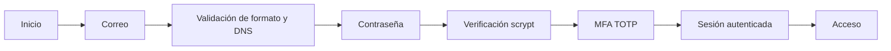

# IDS · Inicio de sesión seguro

Implementación de la práctica 2.1 con Flask, SQLite y una interfaz adaptable en español.

## Ejecutar

```sh
cd /workspace/IDS
python -m venv .venv
.venv/bin/pip install -r requirements.txt
.venv/bin/python app.py
```

El servidor de desarrollo escucha en el puerto 8000. Abre `/registro`, crea una cuenta y escanea el QR con Google Authenticator, Microsoft Authenticator o Aegis (también puedes agregar la clave manual) (TOTP, SHA-1, 6 dígitos, período de 30 segundos). El QR se genera localmente, sin enviar la clave a servicios externos, y solo está disponible durante el registro pendiente. Confirma con el código actual. Para un nuevo inicio de sesión, usa correo, contraseña y un nuevo código. Sincroniza la hora del teléfono.

## Requisitos implementados

- Correo: estructura validada en el servidor y consulta DNS del dominio exacto (MX, A o AAAA); errores de DNS impiden continuar. Esto verifica el dominio, no la existencia ni la propiedad del buzón.
- Contraseña: de 8 a 128 caracteres; permite mayúsculas, minúsculas, números, espacios y símbolos. Se almacena únicamente su hash scrypt con salt, generado por Werkzeug.
- MFA obligatorio: TOTP; el registro solo se guarda al confirmar el segundo factor. Las credenciales por sí solas no dan acceso al panel. Códigos consumidos no se reutilizan.
- Sesiones del lado del servidor con identificador renovado al autenticar, cookies HttpOnly/SameSite, protección CSRF, expiración del desafío en 5 minutos y de la autenticación en 1 hora. Límite de 5 intentos por identidad en 5 minutos.

Los datos locales viven en `instance/`, excluido de Git. Protege este directorio: contiene la base de datos, las sesiones y los secretos TOTP. No compartas claves del autenticador en capturas públicas. Si el entorno bloquea DNS directo, se usa DNS por HTTPS con verificación TLS en `cloudflare-dns.com`; permite este dominio en la configuración de red para poder registrar e iniciar sesión.

## Validación

```sh
.venv/bin/python -m pytest -q
```

Las pruebas cubren registro, hash, credenciales, MFA correcto/incorrecto, rechazo de reutilización, acceso protegido, cierre de sesión, DNS inexistente, contraseña corta, CSRF y limitación de intentos. DNS se simula en las pruebas para que sean reproducibles; el servidor real consulta DNS.

## Evidencias de la práctica



Captura estas situaciones desde el navegador:

1. Correo mal formado y correo con `dominio.invalid` (el formato se valida también desde el navegador).
2. Registro con contraseña menor a 8 caracteres y registro válido.
3. Inicio de sesión con contraseña incorrecta.
4. Pantalla del segundo factor, código incorrecto y código correcto.
5. Panel con el mensaje «Acceso exitoso».

Para capturas del código fuente usa `validate_email`, el uso de `generate_password_hash`/`check_password_hash`, y `totp`/`verify_totp` junto con la ruta `/mfa` en `app.py`. Estas instrucciones preparan las evidencias; no representan capturas ya realizadas.

## Antes de producción

Esta es una aplicación de práctica. Usa un servidor WSGI detrás de HTTPS y `COOKIE_SECURE=1`; no uses el servidor de desarrollo en producción. Añade verificación de propiedad del correo, recuperación segura de cuenta/MFA, cifrado gestionado de secretos TOTP en reposo y límites adicionales por IP en el proxy. El DNS requiere salida al resolvedor configurado. No se necesitan credenciales de correo ni servicios de terceros para ejecutar esta práctica.
